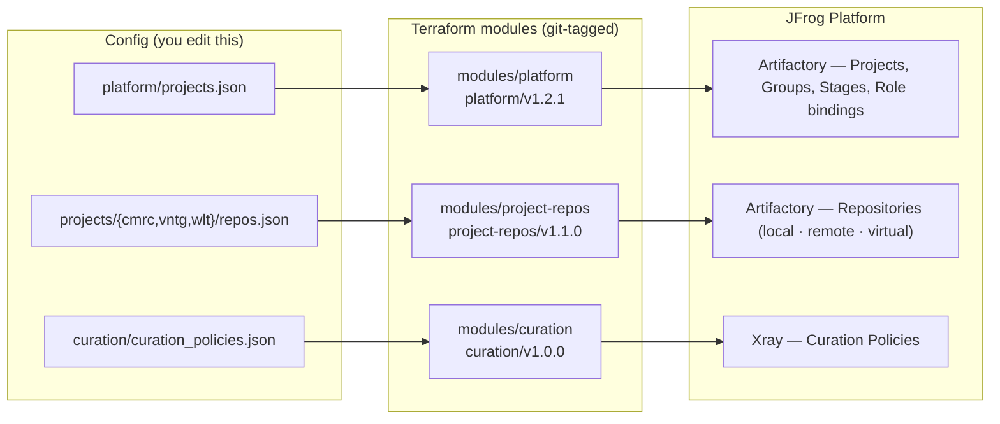
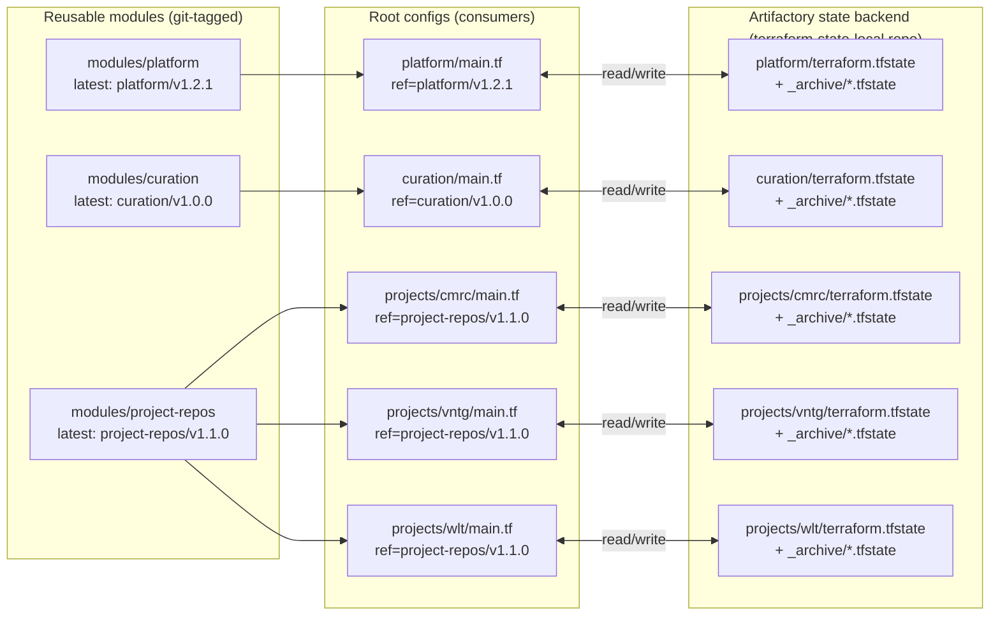
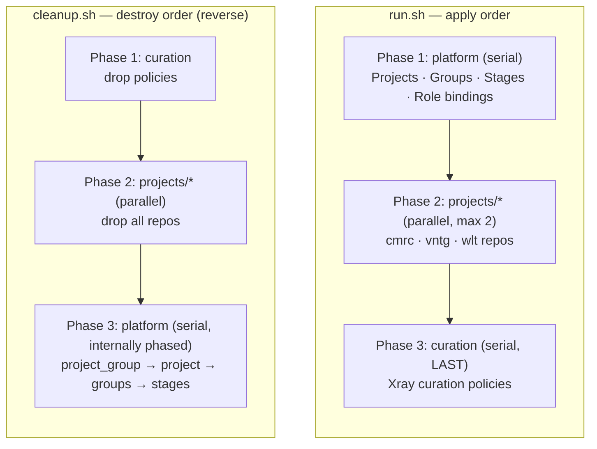

# Architecture diagrams

<p align="left">
  
  &nbsp;&nbsp;
  
</p>

Visual reference for how the pieces fit together. GitHub renders the Mermaid blocks natively.

- [1. Full architecture overview](#1-full-architecture-overview)
- [2. Self-service flow — Issue → PR → apply](#2-self-service-flow--issue--pr--apply)
- [3. State + module versioning](#3-state--module-versioning)
- [4. Apply / cleanup ordering across layers](#4-apply--cleanup-ordering-across-layers)

---

## 1. Full architecture overview

Three vertical pipelines, one per JFrog product surface. Each starts with a JSON file you edit, flows through a versioned Terraform module, and lands as concrete JFrog resources.

<p align="left">
  <a href="https://jfrog.com/artifactory/"> Artifactory</a>
  &nbsp;•&nbsp;
  <a href="https://jfrog.com/xray/"> Xray</a>
</p>



**Reading the diagram top-to-bottom in each column:**
- `platform/projects.json` is consumed by `modules/platform`, which provisions JFrog Projects, IDP groups, lifecycle stages, and group→role bindings.
- `projects/<key>/repos.json` is consumed by `modules/project-repos`, which provisions all local/remote/virtual Artifactory repos for that project.
- `curation/curation_policies.json` is consumed by `modules/curation`, which provisions Xray curation policies.

State for each pipeline lives in its own file in the `terraform-state-local` Artifactory repo (see [diagram 3](#3-state--module-versioning)).

---

## 2. Self-service flow — Issue → PR → apply

What happens when a teammate clicks "New repository" on the GitHub Issue form.

```mermaid
sequenceDiagram
    autonumber
    actor Dev as Developer
    participant GH as GitHub
    participant Bot as intake.yml
    participant PRV as pr-validate.yml
    actor Rev as CODEOWNER
    participant App as apply.yml
    participant JF as JFrog Platform

    Dev->>GH: Open "New repository" Issue
    Note over GH: Template auto-applies<br/>'new-repo' label
    GH->>Bot: trigger (issues:opened)
    Bot->>Bot: parse + validate body
    alt invalid input
        Bot-->>Dev: comment errors<br/>+ apply 'intake-blocked'
    else valid
        Bot->>GH: open PR (edits repos.json)
        Bot-->>Dev: comment "PR opened: #N"
    end

    GH->>PRV: trigger (pull_request)
    PRV->>JF: terraform init + plan<br/>(reads state)
    PRV->>GH: post "Drift detected" comment<br/>with full plan
    GH->>Rev: request review (via CODEOWNERS)

    Rev->>GH: approve + merge to main
    Note over GH: Issue auto-closes<br/>(PR body: "Resolves #N")
    GH->>App: trigger (push to main, paths: terraform/**)
    App->>JF: terraform apply
    App->>JF: archive state snapshot<br/>to _archive/&lt;timestamp&gt;_&lt;sha&gt;.tfstate
    App->>GH: post "Apply completed" comment<br/>with resource counts
```

**Failure paths**
- Invalid form input → `intake-blocked` label, no PR opened. User edits issue, adds `intake-retry` to re-fire.
- Plan fails in CI → comment shows the error. PR stays open until fixed.
- Apply fails after merge → "Apply FAILED" comment. State already in JFrog may be partial; the next apply converges.

---

## 3. State + module versioning

Where state lives per layer, and how modules are pinned by tags so consumers can upgrade independently.



**What this buys you**
- Bumping `modules/project-repos` to a new tag doesn't touch `cmrc` until `cmrc/main.tf` explicitly bumps its `?ref=`. Lets you canary one project at a time.
- Each layer's state is independent — applying `projects/vntg` cannot break `projects/cmrc`.
- Every successful apply leaves a snapshot under `_archive/<timestamp>_<sha>.tfstate` (see [README → State versioning](../README.md#state-versioning-per-apply-history)).

---

## 4. Apply / cleanup ordering across layers

The orchestration enforced by `run.sh` (apply) and `cleanup.sh` (destroy).



**Why this order**
- **Apply forward:** projects must exist before repos can be scoped with `project_key`. Curation last because it has zero dependency on the rest.
- **Destroy reverse:** JFrog refuses to delete a project that still has repos ("containing resources" 400). So repos must go first. Curation has no dependents, so safe to drop first.
- **Per-layer parallelism cap:** Terraform's internal `-parallelism=4` plus CI's `max-parallel: 2` matrix → no more than 8 concurrent JFrog API calls, well under the ~10-concurrent GRPC limit.
